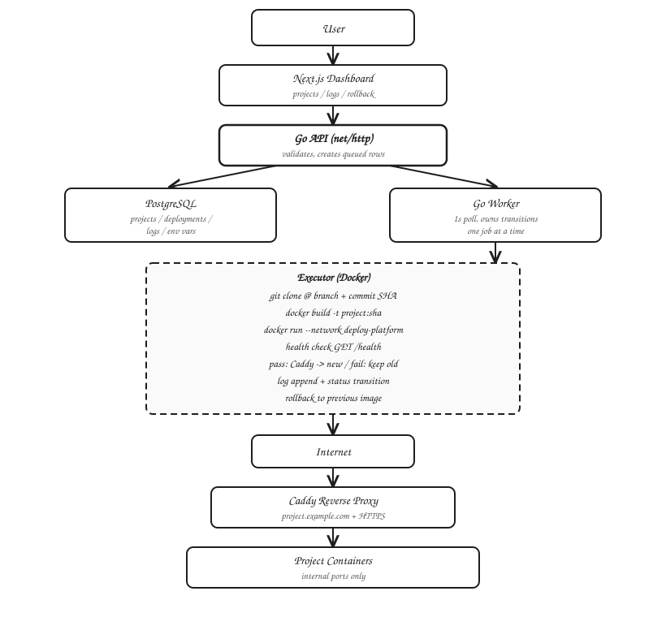
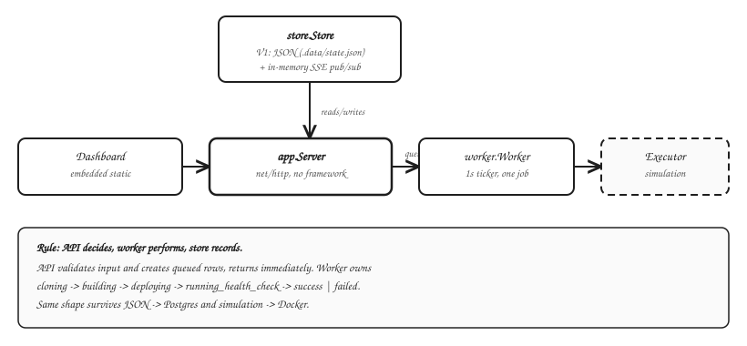
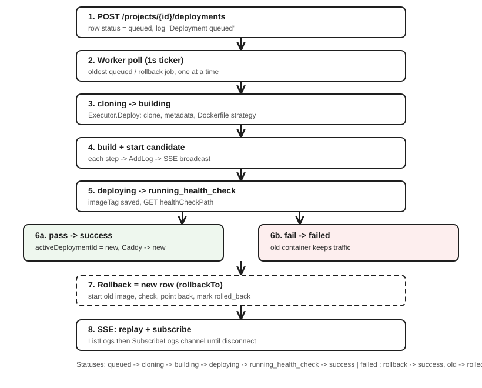

# Deployment Platform

## What it is

Self-hosted deployment platform for a single VPS and a single developer. Input is a GitHub repository URL. Output is a running container behind a live URL.

It handles: repo clone, Docker image build, container start on an internal port, Caddy route update, health check gating, real-time deploy logs, deployment history, and rollback to the previous successful deployment.

Scope is intentionally narrow. No Kubernetes, no multi-region, no teams/billing, no serverless. One server, Docker containers, one reverse proxy.

Current code in this repo is V1: the local control-plane slice. The API, worker, executor boundary, and status machine are real. Persistence is a JSON file and the executor is simulated so Docker/Postgres are not required yet.

## Tech stack

Target stack:

- Backend: Go 1.24, stdlib `net/http`, single binary (API + worker in one process)
- Database: PostgreSQL — `projects`, `deployments`, `deployment_logs`, `environment_variables` (V1 uses `.data/state.json` behind the same `Store` interface)
- Runtime: Docker and Docker Compose, internal Docker network, per-project containers with CPU/memory limits
- Proxy: Caddy for per-project routing (`project.example.com -> container:port`) and automatic HTTPS
- Frontend: Next.js + TypeScript + Tailwind/shadcn (V1 uses an embedded static page served from the Go binary)
- Realtime: Server-Sent Events for deploy logs (`GET /api/deployments/{id}/logs/stream`)
- Observability: structured logs, Prometheus `/metrics`, Grafana (deployment duration, failure count, worker jobs)
- Automation: GitHub webhooks for auto-deploy on push; manual deploy and rollback via API

No framework on the backend. No ORM in V1. No Redis unless the poll-based worker needs a real queue later.

## System architecture

Target shape:

*Editable source: [`docs/diagrams/target-architecture.excalidraw`](docs/diagrams/target-architecture.excalidraw) — open in excalidraw.com.*

V1 implementation in this repo (`cmd/server/main.go`):

*Editable source: [`docs/diagrams/v1-implementation.excalidraw`](docs/diagrams/v1-implementation.excalidraw).*

The core rule: the API never runs infrastructure work. It validates input, creates a `queued` deployment row, and returns. The worker owns all state transitions. The store records every transition. This stays unchanged when JSON becomes Postgres and simulation becomes Docker.

Domain model (`internal/domain/domain.go`):

- `Project`: id, name, repoUrl, branch, healthCheckPath, liveUrl, activeDeploymentId
- `Deployment`: id, projectId, commitSha, imageTag, status, error, startedAt, finishedAt, triggeredBy, rollbackTo
- `DeploymentLog`: id, deploymentId, timestamp, stream (system/stdout/stderr), message
- Statuses: `queued -> cloning -> building -> deploying -> running_health_check -> success | failed`, plus `rollback -> success` and `rolled_back` for the replaced deployment

Deploy flow:

*Editable source: [`docs/diagrams/deploy-flow.excalidraw`](docs/diagrams/deploy-flow.excalidraw).*

Deploy, rollback, and log streaming are covered by the diagram above. The API creates `queued` rows and returns. The worker moves each job through `cloning -> building -> deploying -> running_health_check -> success | failed`, appending a log on every step that is broadcast to SSE subscribers. Rollback creates a new row pointing at the previous success, restarts that image, and points the route back. A failed candidate never replaces the running container.

Failure handling: health check failure leaves the previous container serving traffic and marks only the candidate as failed. Rollback requires a prior success or the API returns 400. Worker failures are logged to the deployment log, not just stdout, so they are visible in the dashboard.

## Docs

- [`docs/go-primer.md`](docs/go-primer.md) — Go from first principles, explained using this codebase as the worked example
- [`docs/architecture.md`](docs/architecture.md) — component breakdown and the API/worker/store rule
- [`docs/next-steps.md`](docs/next-steps.md) — V2 through V6 roadmap
